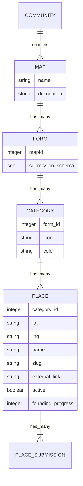

# WHAT'S this DOCUMENT?
This document try to explain what's the relation between Odoo servers that stores the information and maps builder which is the frontend for that information.

Maps builder has 3 tasks:
1. Show places in a map
2. Capture visitors interest in a place in the map
3. Allow visitors to suggest new places.

This document has two main areas.
1. **Endpoints**: Explain what API endpoints MUST implement an Odoo server (or whatever server) to use this service.
2. **Relations**: Explain what are the relations between the entities shown in a map.

## Endpoints
These are the endpoints an Odoo server has to have to use this builder. We try to follow REST as much as possible.
- `GET - /:map_id/config` - Community config like `theme: { color: '#someColor', forms: 'i***FORMS INFO'}`
-  `GET - /:community_id/:map_id/places/` - List of places in a map.
-  `GET - /:community_id/:map_id/places/:id` - Place show view of a map
-  `POST - /:map_id/places/:id/submissions` - Endpoint to create a place submission.
-  `POST - /:map_id/suggestions` - Endpoint to create a suggestion on that map. The user choose the category and with that we determine the type of place and form

### About FORMS INFO
In the `/:map_id/config` we send these information:
``` json
{
  "config": {
    "theme": {
      "brandColors": {
        "bgColor": 'A COLOR',
        "textColor": 'A COLOR',
      }
    },
    "tileStyle": 'osm' // Check ./src/lib/tiles.ts
  },
  "forms": [
    {
      "id": A_NUMBER,
      "map_id": A_NUMBER
      "submission_schema": "A JSON OBJECT WITH THE FIEDS FOR THIS FORM"
      "categories": [
        {
          "form_id": A_NUMBER,
          "icon": "A VALID FONT AWESOME ICON",
          "color": "A VALID COLOR OF OUR LIST"
        },
        ...// More categories
      ]
    },
    ...// More forms
  ]
}
```

## Relations
TLTR;
- A community can have many `maps`.
- A map can have many `forms`.
- A form can have many `places`
- A place can have many `place_submisions`.

* `place_submisions` are not represended in the map but the place update its `founding_progress` field each time
a user fills a place submission.

Now let's see visually these relations:
**NOTE** We use [mermaid](https://mermaid-js.github.io). Use their [online editor](https://mermaid-js.github.io/mermaid-live-editor) for editing this diagram.


### CROWDFOUNDING TYPES
Crowdfounding models is something that is not directly related with this proyect.
The way our Odoo servers expose what they can capture is through `forms.submission_schema` JSON field.
This field will tell React how the UI of the submision form should look. And what to send back to the server.
Is responsability of the server to validate and store the information send from the maps.

Beind said that. These are some of the crowdfounding models we contemplate

- `crowdfounding_types`
  - `none` - by default is interest in users
  - `ammount_of_money` - (ABSOLUTE) User compromise a fixed amount of money
  - `loan` - (ABSOLUTE) User compromises a contribution and he receives a yearly interest + some benefits on the service (optional) + return of the contribution after loan period is over.
  - `loan_on_credit` - (ABSOLUTE) User compromises a contribution and the yearly interest goes on usage credit + benefits on the service (optional) + return of the contribution after loan period is over.
  - `monthly_fee` - (MONTHLY) User compromise a monthly fee
    - `credit` - To be used on the service.
    - `fee` -  For being able to use the system with certain improved conditions.
    - `credit_and_fee` - Combination of both.
  - `mileage` - (KILOMETRAJE) User compromises a certain amount of mileage to be used on the vehicle.

** Not all of type of crowdfounding can be mixed.


