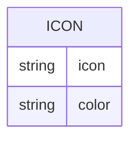

# Icons for places
Each map have one or more categories. Each category has an icon. Now we load all icons from
[Fontawesome](https://fontawesome.com/) but we could build our own icon library and add our own icons when needed for each community.
The way to do that is using an icon builder like [Icomoon](https://icomoon.io/).

## Icon field
Is a list of icons base on Fontawesome at the moment

## Icon color
Is a closed list of colors. TO BE DEFINED.
